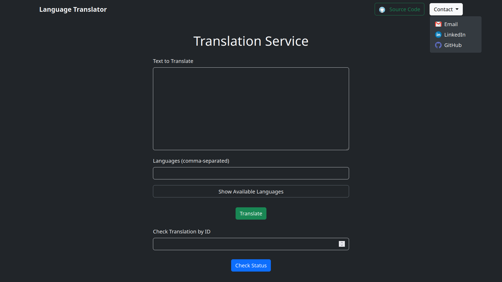
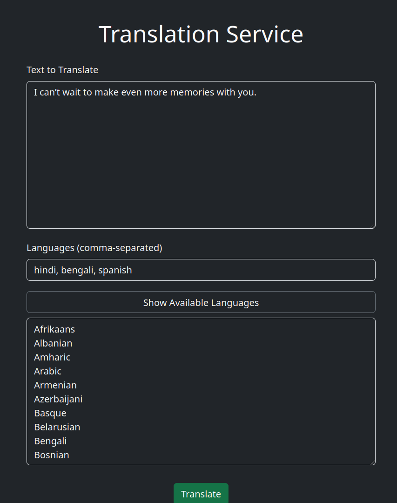
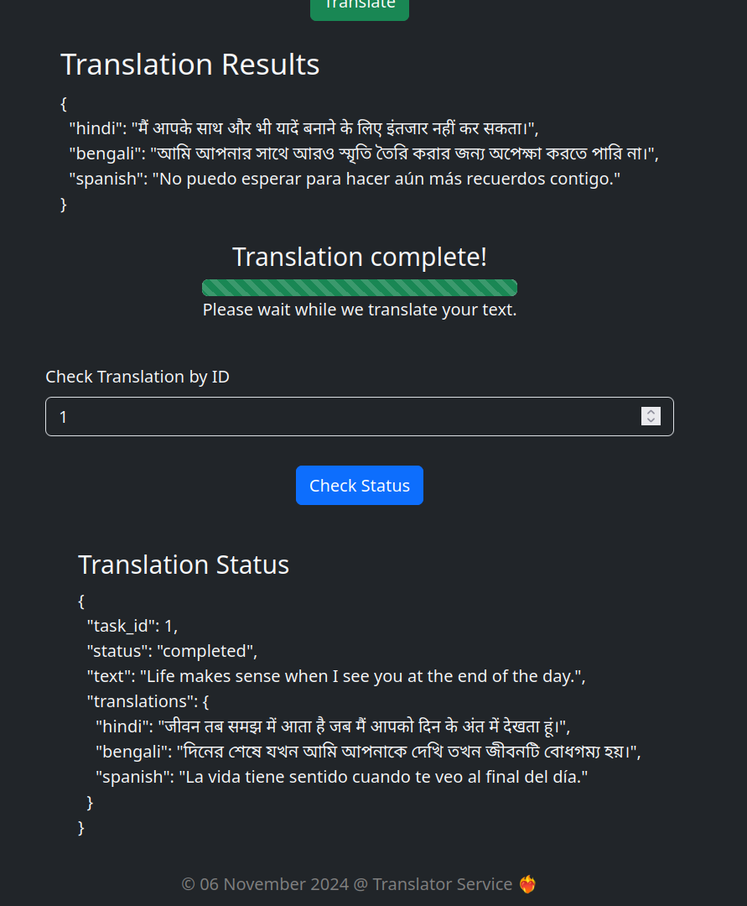

# Language Translator Service

This service is built using FastAPI and provides an API for translating text between different languages. It integrates with the Google Translate API and maintains a database of translation tasks, allowing users to submit text for translation and check the status and results of their requests.

## Features

- Translate text between multiple languages using the Google Translate API.
- Maintain a database of translation tasks to track their status and results.
- Asynchronous translation processing with FastAPI for improved performance.

## Images

**Tried Translations... & UI**

<div style="display: flex; justify-content: center; gap: 10px;">
    
   
</div>
<div>
   <br>
   
   &nbsp;
   
</div>

## Components List

- **FastAPI**: The web framework used to build the API service.
- **Google Translate API**: Provides translation capabilities.
- **SQLAlchemy**: ORM used for database operations.
- **Jinja2**: Templating engine for rendering HTML pages.
- **Bootstrap**: CSS framework for styling the frontend.

## How to Use Locally

1. **Clone the repository**:
   ```bash
   git clone https://github.com/DarkDk123/Lang-Translation-Service-FastAPI
   cd Lang-Translation-Service-FastAPI
   ```

2. **Set up a virtual environment**:
   ```bash
   python3 -m venv .venv
   source .venv/bin/activate
   ```

3. **Install dependencies**:
   ```bash
   pip install -r requirements.txt
   ```

4. **Configure environment variables**:
   Create a `.env` file and add your database URL.

5. **Run the FastAPI server**:
   ```bash
   cd app # go to app directory
   uvicorn main:app --port 8000
   ```

6. **Access the service**:
   Open your browser and go to `http://localhost:8000` to use the Language Translator Service.